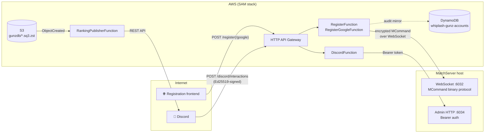

<div align="center">

# Whiplash GunZ API

**Serverless bridge between the web, Discord, and the Whiplash GunZ MatchServer.**

AWS SAM stack of Lambda functions that handles player account registration, Discord slash commands, and automated leaderboard publishing for [Whiplash GunZ](https://github.com/LostMyCode/whiplash-gunz) — GunZ: The Duel running in the browser via WebAssembly.

[](LICENSE)


</div>

---

## What this does

The GunZ **MatchServer** (the native game server from [whiplash-gunz](https://github.com/LostMyCode/whiplash-gunz)) has no public web surface of its own. This stack puts one in front of it:

- **Account registration** — a web frontend POSTs to `/register` (username + password, Turnstile-protected) or `/register/google` (Google ID token). The Lambda then speaks the GunZ **MCommand binary protocol directly over WebSocket** to the MatchServer to create the account.
- **Discord slash commands** — Discord interactions (e.g. `/claim` for daily bounty codes) are verified and forwarded to the MatchServer's **Admin HTTP API** with a bearer token.
- **Leaderboard publishing** — S3 backup uploads of the game database trigger a Lambda that parses the SQLite snapshot in pure JS/WASM and posts a ranking embed to a Discord channel.

## Architecture



| Function | Route / Trigger | Language | Purpose |
|---|---|---|---|
| `DiscordFunction` | `POST /discord/interactions` | JS (no build) | Verifies Ed25519 signature, dispatches slash commands to the Admin HTTP API |
| `RegisterFunction` | `POST /register` | TS (esbuild) | Turnstile CAPTCHA check, then account creation over the game protocol |
| `RegisterGoogleFunction` | `POST /register/google` | TS (esbuild) | Google ID token login / first-time auto-registration |
| `RankingPublisherFunction` | S3 `ObjectCreated` | TS (esbuild) | zstd-decompresses + queries SQLite backups, posts leaderboards |

Each function under `src/` is a **self-contained package** with its own `package.json` and `node_modules`. There is no root Node project.

### The game protocol client

`src/register/matchserver.ts` is a from-scratch TypeScript implementation of the GunZ client wire protocol:

- 6-byte `MPacketHeader` + MCommand payload, all little-endian.
- Transport is WebSocket (`[0x01][payload]` binary frames), matching the MatchServer's `WebSocketListener`.
- The `MSGID_REPLYCONNECT` handshake yields server/client UIDs and a timestamp, from which a 32-byte XOR/bit-rotation cipher key is derived — **byte-for-byte identical** to the C++ `MMakeSeedKey` / `MPacketCrypter` in whiplash-gunz. If you change the key schedule or cipher on either side, you must change it on both. See the header comment in `matchserver.ts` for the full wire format.
- Passwords are BLAKE2b-hashed (libsodium) client-side and sent as an `MPT_BLOB`.

## Getting started

### Prerequisites

- AWS SAM CLI
- Node.js 22+
- A running MatchServer built from [whiplash-gunz](https://codeberg.org/LostMyCode/whiplash-gunz) (`./build-matchserver-ws.sh`), reachable from the Lambdas

### Build & deploy

```bash
sam build
sam deploy --guided   # first time; afterwards: sam deploy
```

Required parameter overrides (all secrets are `NoEcho` SAM parameters — never commit values):

```bash
sam deploy --parameter-overrides \
    MatchServerHost=<HOST> \
    GameServerPort=6032 \
    AdminServerPort=6034 \
    AdminServerSecret=<ADMIN_SECRET> \
    DiscordPublicKey=<HEX_KEY> \
    RegistrationSecret=<REG_SECRET> \
    TurnstileSecretKey=<TURNSTILE_SECRET> \
    GoogleClientId=<GOOGLE_CLIENT_ID>
```

> **Note:** `GameServerPort` must be the MatchServer's **WebSocket** port (default build: `6032`). The raw TCP game port (6000) is not usable by this stack.

To enable ranking posts, also pass:

```bash
DiscordBotToken=<BOT_TOKEN> \
DiscordRankingChannelId=<CHANNEL_ID> \
GunzBackupBucket=<BUCKET> \
GunzBackupPrefix=gunzdb/ \
RankingTopN=10
```

The S3 bucket notification is **not** managed by this stack — configure the bucket manually to invoke `RankingPublisherFunction` for `ObjectCreated` events matching `gunzdb/*.sq3.zst`.

Alternatively, `./scripts/deploy.sh` wraps the above: it reads every value from environment variables and interactively prompts for any missing secret.

### Registering Discord slash commands

Fill in `APPLICATION_ID` / `BOT_TOKEN` / `GUILD_ID` in `scripts/register-discord-commands.sh` **locally** (never commit real values) and run it once per command change.

### Local development

There are no automated tests yet. Typecheck the TypeScript functions individually:

```bash
cd src/register && npm install && npx tsc --noEmit
cd src/ranking  && npm install && npx tsc --noEmit
```

For a full end-to-end check, run a local MatchServer from whiplash-gunz and point a deployed dev stack (or `sam local start-api` with a `.env.json`) at it, then:

```bash
curl -X POST https://<api>/register \
  -H 'content-type: application/json' \
  -d '{"username":"test","password":"secret123","email":"t@example.com","turnstileToken":"<token>"}'
```

## Configuration reference

### `DiscordFunction`

| Variable | Required | Description |
|---|---|---|
| `DISCORD_PUBLIC_KEY` | yes | Discord application public key (hex) for Ed25519 verification |
| `MATCHSERVER_HOST` | yes | MatchServer IP / hostname |
| `MATCHSERVER_PORT` | | Admin HTTP port (default `6034`) |
| `MATCHSERVER_SECRET` | yes | Bearer token for the Admin HTTP API |
| `MATCHSERVER_USE_HTTPS` | | `true` to use HTTPS (default `false`) |

### `RegisterFunction` / `RegisterGoogleFunction`

| Variable | Required | Description |
|---|---|---|
| `MATCHSERVER_HOST` | yes | MatchServer IP / hostname |
| `MATCHSERVER_PORT` | yes | MatchServer **WebSocket** port (`6032` in the default build) |
| `REGISTRATION_SECRET` | | Shared secret sent with account creation; must equal the server's `REGISTRATION_SECRET` |
| `TURNSTILE_SECRET_KEY` | yes | Cloudflare Turnstile secret (`/register` only) |
| `GOOGLE_CLIENT_ID` | Google only | Google OAuth 2.0 client ID |
| `REGISTERED_ACCOUNTS_TABLE_NAME` | injected | DynamoDB audit table name |

### `RankingPublisherFunction`

| Variable | Required | Description |
|---|---|---|
| `DISCORD_BOT_TOKEN` | yes | Bot token used for channel posts |
| `DISCORD_RANKING_CHANNEL_ID` | yes | Target channel ID |
| `RANKING_BACKUP_PREFIX` | | Accepted S3 key prefix (default `gunzdb/`) |
| `RANKING_TOP_N` | | Number of players to post (default `10`) |

The ranking function deliberately avoids native SQLite/zstd bindings, Lambda layers, and container images (`sql.js` + `fzstd` are pure JS/WASM) so it stays portable on `arm64` — please don't reintroduce native binary dependencies.

## Registered accounts mirror

Successful registrations are mirrored best-effort into DynamoDB (`whiplash-gunz-accounts`), keyed by `accountKey` (the MatchServer `UserID`; `g_<hash(sub)>` for Google accounts) with a conditional put so re-registration is a no-op. Fields: `username`, `authProvider`, `email`, `sourceIp`, `userAgent`, `route`, `stage`, `requestId`, `createdAt`, `updatedAt`, `matchserverMessage`. Only the two registration Lambdas have `dynamodb:PutItem`.

## Related projects

- **[whiplash-gunz](https://github.com/LostMyCode/whiplash-gunz)** — the WASM client and the native MatchServer this stack talks to. The MCommand protocol, key schedule, Admin HTTP routes, and `REGISTRATION_SECRET` are shared contracts between the two repositories; cross-cutting changes must land in both. The GitHub repo is a landing page; full source and history are hosted on [Codeberg](https://codeberg.org/LostMyCode/whiplash-gunz).

## Security

See [SECURITY.md](SECURITY.md) for how to report vulnerabilities privately. Please **never** open a public issue for a security problem, and never include tokens or secrets in issues or logs.

## License & disclaimer

Released under the [MIT License](LICENSE).

This project is an independent community effort and is **not affiliated with or endorsed by** MAIET Entertainment, ijji, or any rights holder of GunZ: The Duel. It contains no proprietary game assets; it only provides account/community tooling for a server you host yourself. Please respect the licenses and attribution of the upstream GunZ source lineage.
